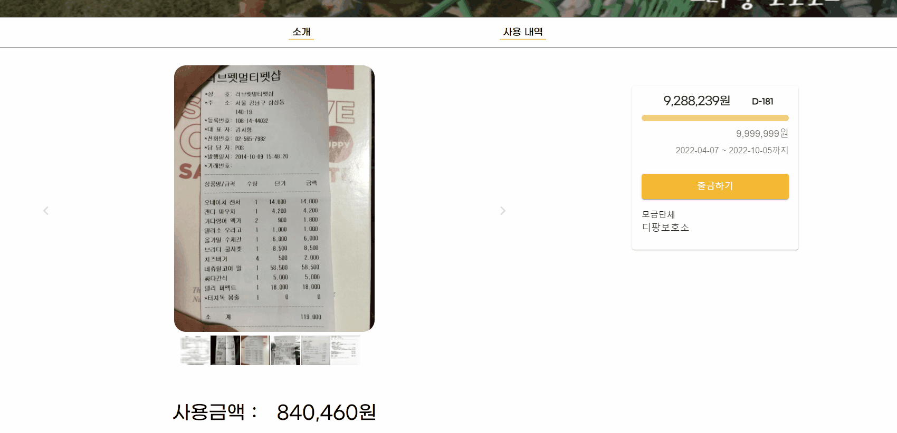

 

# 세상에 나쁜 기부는 없다(세나기)

> **블록체인 에스크로 서비스를 활용한 유기동물 기부 플랫폼**  
> **개발기간 : 2022.02.28 ~ 2022.04.08**

 

## 🙆‍♂️ 팀원 소개

|김민현|김경동|이동호|박해인|백철연|이아현|
|:-:|:-:|:-:|:-:|:-:|:-:|
|||||||
|Backend|Backend|Blockchain|Frontend|Frontend|Frontend|
[@ethanKim93](https://github.com/ethanKim93)|[@kyoungDongDD](https://github.com/kyoungDongDD)|[@Kodo92](https://github.com/Kodo92)|[@haiyinde](https://github.com/haiyinde)|[@backcy855](https://github.com/backcy855)|[@alskal1](https://github.com/alskal1)|

 

## :pushpin: 프로젝트 소개

  ### 배경

  사람들을 기부하지 않는 이유 1위는 , 후원 단체를 신뢰할 수 없어서라고 합니다.이러한 불신의 문제는 기부문화를 자체를 얼어붙게 만들어, 간절한 도움이 필요한 단체나 동물들이 적절한 후원을 받지 못하게 됩니다.

  `세나기`는 이러한 개인과 단체의 신뢰 문제를 블록체인을 활용한 스마트컨트렉트 서비스와 OCR을 활용하여 이러한 문제점들을 해결하고자 하였습니다.  
  
   ### 타겟🎯

   유기동물을 위한 기부 서비스를 찾는 사람들
   기존 기부 서비스에 대한 불신을 가지고 있는 사람들
  
  👉 **유기동물을 위해 투명한 기부를 하고 싶은 사람들**

  ### 목적🥅

  **신뢰성 있는 기부 플랫폼을 만들자**

  ### 의의

   불신으로 가득한 기부문화 개선
   다양한 단체의 기부 캠페인을 한번에 볼 수 있는 플랫폼 역할

 
   

## :pushpin: 기술 스택

<table>
    <tr>
        <td><b>Back-end</b></td>
        <td>

 

 

</td>
    </tr>
    <tr>
    <td><b>Front-end</b></td>
    <td>

    </td>
    </tr>
    <tr>
    <td><b>Infra</b></td>
    <td>

</td>
    </tr>
    <td><b>Block-chain </b></td>
    <td>
    
    
    </td>
    </tr>
    <tr>
    <td><b>Tools</b></td>
    <td>
    
    

    </td>
    </tr>
</table>

 

## 🔎서비스 기능 소개

👉시연 영상 youtube👉 https://www.youtube.com/watch?v=3itie8Ch4S0
  
### 랜딩 페이지

### 회원가입

> 아이디, 닉네임 중복확인  
> 회원가입시 자동 지갑 생성

### 기부 하기

### 기부 내역 확인(마이페이지-후원자 로그인)

### 나의 캠페인 리스트 (마이페이지 - 보호소)

### 출금하기(OCR)

> 영수증 이미지를 첨부하여 영수증 값 추출  
> 추출된 금액만큼 캠페인에서 출금 가능

### 총 출금 내역

> 출금된 영수증 내역 조회

### 검색 결과

### 조건별 정렬

> 마감임박순, 최신순, 조회순으로 정렬 가능  
> 종료 여부 정렬 가능

 
 

## 🏗️프로젝트 구성

### 서비스 아키텍쳐

### 기부 프로세스

## 👨‍💻프로젝트 진행

<h3><a href="https://spring-astrodon-387.notion.site/P2P-a16a77fef9c34d7b983e8fe569365a8b">팀 노션</a>　|　
<a href="https://www.figma.com/file/N9qlwrJ4jB4s5CBNLUjwX3/%EC%84%B8%EB%82%98%EA%B8%B0"> FIGMA </a>　|　
<a href="https://docs.google.com/spreadsheets/d/14jT-Af2OJMfkrReO5qDPt3S-FcqphmEPx6oy-zsFPaU/edit"> 백 로그</a>　|　
<a href="https://www.erdcloud.com/d/zn43wETn4QF8tuaAW"> ERD </a>　|　
<a href="https://spring-astrodon-387.notion.site/1925dcb50e26444a9c9dbb2e5f73d762"> 지식 공유 </a>　

